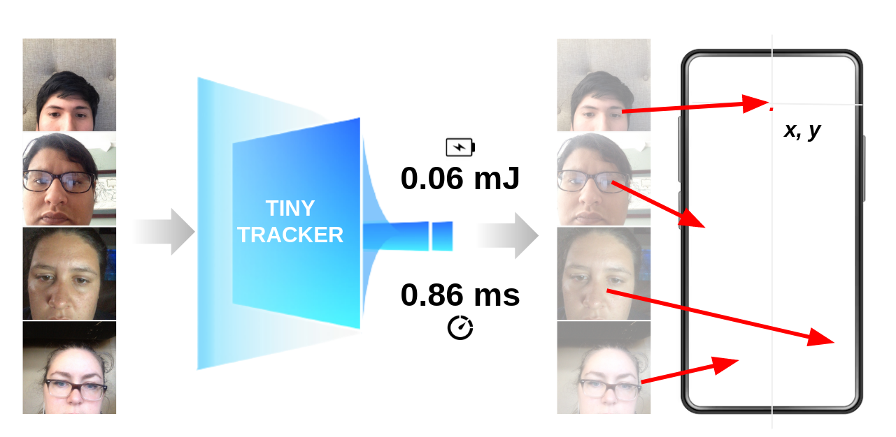

#  👀 TinyTracker: Gaze Estimation on Edge Devices  👀
[](https://paperswithcode.com/paper/tinytracker-ultra-fast-and-ultra-low-power)

### [💻 Blog](https://www.hackster.io/news/gazing-into-the-future-of-ai-57d4acd77f4b) |[📜 Paper](https://arxiv.org/abs/2307.07813) | [🗂️ Data](https://gazecapture.csail.mit.edu/)

[TinyTracker: Ultra-Fast and Ultra-Low-Power Edge Vision In-Sensor for Gaze Estimation](https://arxiv.org/abs/2307.07813)  
 [🧑🏻‍🚀 Pietro Bonazzi ](https://linkedin.com/in/pietrobonazzi)\*<sup>1</sup>,
 [🧑🏼‍🚀 Thomas Rüegg](https://www.linkedin.com/in/thomas-rüegg-680a351b1/)\*<sup>1</sup>,
 Sizhen Bian <sup>1</sup>,
 Yawei Li<sup>1</sup>,
 Michele Magno<sup>1</sup>  <br>

\*denotes equal contribution  
ETH Zurich, Switzerland  <br> 
in IEEE Sensor 2023 (Lecture Presentation)




## 🚀 TL;DR quickstart 🚀
1. Install requirements
```
python3 -m venv venv
source venv/bin/activate
pip3 install -r requirements.txt
```
2. Install [tensorflow](https://www.tensorflow.org/install)
3. get [haarcascade](https://github.com/opencv/opencv/blob/master/data/haarcascades/haarcascade_frontalface_default.xml) detector for the face and store it in a new directory called "haarcascade"
```
mkdir haarcascade
cd haarcascade
wget https://github.com/opencv/opencv/blob/master/data/haarcascades/haarcascade_frontalface_default.xml
```
4. run WebcamDemoTflite.py 
```
python WebcamDemoTflite.py 
```
If everything works without errors, you can now track your gaze with your webcam and compare TinyTracker to TinyTrackerS.
Red point: TinyTracker
Pink point: TinyTrackerS

## What is a TinyTracker?
TinyTracker and TinyTrackerS are highly efficient, fully quantized models for 2D gaze estimation designed to maximize the performance of the edge vision systems considered in the study (i.e Sony IMX500, Sony Spresense and Coral Dev Micro).

| Name                                             | Input res. | Params | MAC   | Size [Kb] | 
|--------------------------------------------------|------------|--------|-------|-----------|
| [TinyTracker](https://arxiv.org/abs/2307.07813)  | 112x112    |   455k | 11.8M |       608 |
| [TinyTrackerS](https://arxiv.org/abs/2308.12313) | 96x96      |  85.8k |  5.3M |       169 |


## How to train your TinyTracker :)

Here we show how to train our code on the GazeCapture Dataset. 
You can download the data used in the paper [here](https://gazecapture.csail.mit.edu/).

Unzip dataset by: 
```
mkdir GazeCapture
tar -xf GazeCapture.tar -C ./GazeCapture
cd GazeCapture
ls | grep ".tar.gz$" | xargs -I {} tar -xf {}
ls | grep ".tar.gz$" | xargs -I {} rm {}
```
Process dataset by running:
```
python prepareDataset.py --dataset_path /path/to/Dataset --output_path /path/to/Processed/Dataset
```
To train TinyTracker:

```
python train_TinyTracker.py --data-path /path/to/Processed/Dataset
```
To train TinyTrackerS:
```
python train_TinyTrackerS.py --data-path /path/to/Processed/Dataset
```

You can control other arguments with these commands: 

```
    --data-path # Path to the dataset
    --num-epochs # Number of epochs to train
    --batch-size # Batch size for training
    --image-size # Image input size
    --learning-rate # Learning rate for training
    --pretrained # Path to pretrained model
    --backbone # Choosing which backbone to use
    --grid-emb # If grid embedding should be used
    --grey # If input images are greyscale

```

## How to export TinyTracker on tflite

```
python convert_tlfite.py --path path/to/model.htf5
```

To convert tflite to .cc you can use this command

```
xxd -i path/to/model.tflite > path/to/model.cc
```

## 🌲 Navigation on the repo 🌲

The project structured as following :

    .
    ├── demo                                # Demo Script folder
    │    └── SpresenseDemo.py               # Spresense Demo Script
    ├── models                              # Model Checkpoints
    │   ├── TinyTracker.tflite              # TinyTracker model checkpoint
    │   └── TinyTrackerS.tflite             # TinyTrackerS model checkpoint
    ├── src                                 # assets, instructions, requirements file for virtual environments
    │   ├── evaluate_tflite.py              # Evaluation script for tflite models
    │   ├── ITrackerDataTF.py               # Dataloader for GazeCapture dataset
    │   ├── json_utils.py                   # Helper functions for json files
    │   ├── TinyTrackerS.py                 # TinyTrackerS model class
    │   ├── TinyTrackerTF.py                # TinyTracker model classes
    ├── convert_tflite.py                   # Tflite conversion Script
    ├── prepareDataset.py                   # Dataset processing script
    ├── train_TinyTracker.py                # Training script for TinyTracker
    ├── train_TinyTrackerS.py               # Training script for TinyTrackerS
    ├── WebcamDemoTflite.py                 # Webcam Demo for both TinyTracker and TinyTrackerS
    .

## ✉️ Citation ❤️

```
@inproceedings{bonazzi2023tinytracker,
  title={TinyTracker: Ultra-Fast and Ultra-Low-Power Edge Vision In-Sensor for Gaze Estimation},
  author={Pietro Bonazzi, Thomas Ruegg, Sizhen Bian, Yawei Li, Michele Magno},
  year={2023},
  booktitle={IEEE Journal Sensor},
}
```

```
@inproceedings{ruegg2023tinytrackers,
  title={Gaze Estimation on Spresense},
  author={Thomas Ruegg, Pietro Bonazzi, Andrea Ronco},
  year={2023},
  booktitle={Sony Challenge},
}
```
